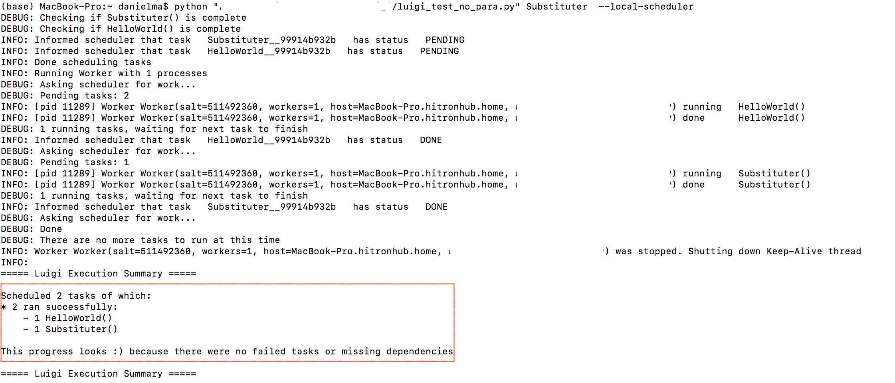
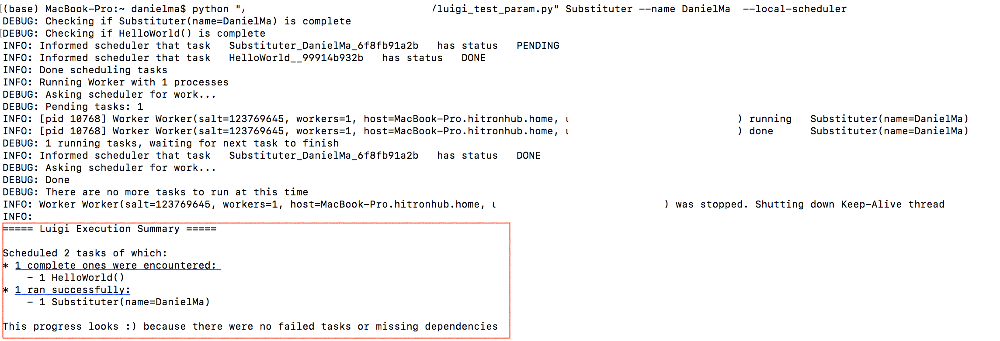
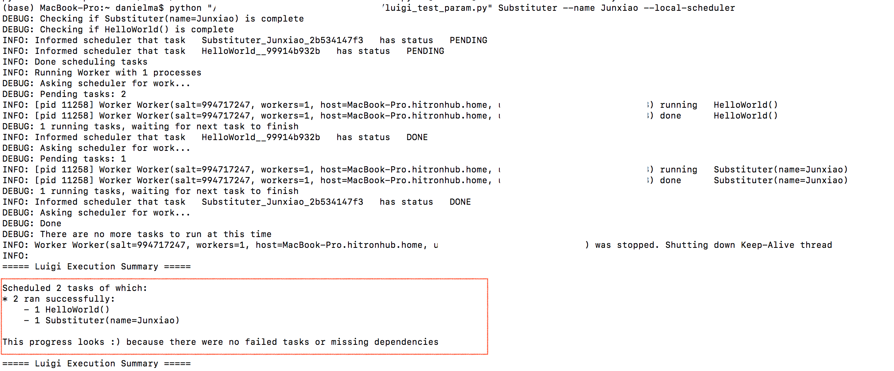

## 1. Introduction
### 1.1 What is Luigi?


*pic is from https://github.com/spotify/luigi*

A very nice official definition is listed [here](http://blog.adnansiddiqi.me/create-your-first-etl-in-luigi/): Luigi is a Python (2.7, 3.6, 3.7 tested) package that helps you build complex pipelines of batch jobs. It handles dependency resolution, workflow management, visualization, handling failures, command line integration,and much more. 


### 1.2 Pipeline Structure

The structure of a pipeline in Luigi, like one of many pipeline systems, resembles that of a graph. It contains nodes, where information is processed and edges connecting the nodes, transferring the information to the next node.

This process would, normally, follow a linear flow, in which the first node is considered the start node, this is the first to be executed, followed by a second, then a third until the end-node completes the workflow. Something resembling this:

> Start -> Node A -> Node B -> Node C -> End

One special feature about the Luigi pipeline structure is that the workflow sequence is reversed. The program starts from the last task, it checks if it can be executed or if it requires anything. If that is the case, it moves up to the pipeline until it finds a node that has all requirements satisfied, and only then, it starts running the nodes already visited. Like in the following:
> Start -> Node C -> Node B -> Node A -> Node B -> Node C -> End

This methodology could seem counterintuitive at first, but it actually helps to avoid rerunning nodes already executed after a failure or error appears.

In fact, that's another feature of the Luigi pipeline, that is it will check the nodes reversely and skip the nodes that are already executed and start from a node that is totally new.

Let’s image to run our pipeline a first time, and in this first run Node B fails:
> Start -> Node C-> Node B -> Node A (Done) -> Node B (Error) -X-> Node C -> End

After we have manually fixed the error in Node B the pipeline can run again but, in this occasion, it will not consider Node A.

## 2. Basic Components
As mentioned, the Luigi package works like a graph. The nodes in Luigi are called Tasks and the edges are called Targets.

- **Target**:- In simple words, a target holds the output of a task. A target could be a local(e.g: a file), HDFS or RDBMS(MySQL etc). Target is the edge connecting a Tasks to the next. These are usually represented as a file. The file ‘helloworld.txt’ was a Target in our following example. A Task can be considered complete if and only if each of its output Targets exist. They can be as simple as empty files, an S3 or whatever.
- **Task**:- Task is the basic building blocks of Luigi and something where the actual work takes place. 
    
    A task could be independent or dependent. The example of a dependant task is dumping the data into a file or database. Before loading the data the data must be there by any mean(scraping, API, etc). Each task is represented as a Python Class which contains certain mandatory member functions. To create a task you have to create a class and inherit the class luigi.Task. A task function contains the following methods:
    - **requires()**:- This member function of the task class contains all the task instances that must be executed before the current task. In the example I shared below, a task, named `HelloWorld`, will be included in the `requires()` method of task `Substituter`, hence make a task a dependant task.

        Most commonly this method makes a call to another Luigi Task above the workflow, allowing the code to move backward to the beginning of the pipeline. Only when a method requires is satisfied that Task can execute. 
    - **output()**:- This method contains the target where the task output will be stored. This could contain one or more target objects. Although, it is recommended that any Task only return one single Target in output.

    - **run()**: In this method is contained the action that the task has to execute. It can be anything, a call to another method, the running of a script, etc.

The following is an example of naive ETL. It is is desigend to put 'Hello World' in a text file and then replace 'World' with your input name.

import time
import luigi
 
 ```
 
# Task A - write hello world in text file
class HelloWorld(luigi.Task):
    def requires(self):
        return None
    def output(self):
        return luigi.LocalTarget('/Users/danielma/Documents/Luigi/original.txt')
    def run(self):
        with self.output().open('w') as outfile:
            outfile.write('Hello World!\n')
 
 
# Task B - pick the text from helloworld.txt, replace World with the input name
class Substituter(luigi.Task):

    def requires(self):
        return HelloWorld()
    def output(self):
        return luigi.LocalTarget( self.input().path + '_name2_' + 'Daniel')
    def run(self):
        with self.input().open() as infile, self.output().open('w') as outfile:
            text = infile.read()
            text = text.replace('Hello', 'Daniel')
            outfile.write(text)


if __name__ == '__main__':
    luigi.run()
```

In this example,
- The first Task is `Substituter()`, it requires the class `HelloWorld()` so it moves there.
- `HelloWorld()` has no requires so it calls it’s run() method and it creates a file calls “words.txt”
- The `output()` in `HelloWorld()` writes 'Hello World!' into the file 'original.txt' and it returns it in the form of a LocalTarget class object with the file 'original.txt', back to the class `Substituter()`.
- `Substituter()` can execute `run()` now. It takes what needed from `self.input()`
- Afterword, it execute `output()` with a saved file replacing 'Hello' with 'Daniel' in the input file. 

**Note**: `Task.input()` is a wrapper around Task.requires() that returns the corresponding Target objects instead of Task objects.

To run this pipeline, simply type the following command in the prompt/terminal:

`python luigi_pipeline_name.py --local-scheduler Substituter`

An outline of this command is:

- `python` specifies the language to excute the Luigi pipeline file.
- `luigi_pipeline_name.py` is the python file that includes the Luigi pipeline. 
- Scheduler
    
   When luigi is launched and a task is given to it a Worker object is created. Workers need to talk to a Scheduler, which manages the dependency graph of tasks and tells workers what to do. So when the local worker object is created, it can either:

   1. Create a local scheduler in the process
   2. or Connect to a remote scheduler using the HTTP API. This is the default.
   
  **Local scheduler**: The local scheduler can be used by passing --local-scheduler to the luigi runtime. When running with the local scheduler, the algorithm given above is run recursively, and then luigi exits. This is usually only used for testing and debugging purposes.

  **Central scheduler**: More interesting is the central scheduler. The central scheduler is a separate luigid Python Tornado app that workers can talk to over HTTP. It performs two tasks: scheduling of tasks based on the dependency graph and serving a simple web dashboard on port 8082 (default). More information about the **Central scheduler** can be found [here](http://bytepawn.com/luigi.html#:~:text=Local%20scheduler%3A%20The%20local%20scheduler,scheduler%20to%20the%20luigi%20runtime.&text=It%20performs%20two%20tasks%3A%20scheduling,on%20port%208082%20(default).).

- `Substituter` is the starting node or the first task you need to excute. Note that the sequence is reversed. 

If the task runs sucessfully, we will have the following results:



**Note**: if you already ran one or some of the tasks in your pipeline, it will be skipped as mentioned above. For example, if I change the word to replace to from "Daniel" to other word say "DanielMa", `HelloWorld()` task won't ran anymore and will be skipped to `Substituter()` (indicated in the red box of the following graph). 



## 3. External Task and External Parameter

The Luigi pipeline can also takes external tasks or external parameters. For example:

```
class LogFiles(luigi.ExternalTask):
    date = luigi.DateParameter()
    def output(self):
        return luigi.contrib.hdfs.HdfsTarget(self.date.strftime('/log/%Y-%m-%d'))
```
The `ExternalTask` means you have a a simple Target object that is created externally. `DateParameter()` is the external parameter that you can specify yourself. Let's change the first example by inserting an external parameter: 

```
import time
import luigi
 
 
# Task A - write hello world in text file
class HelloWorld(luigi.Task):
    def requires(self):
        return None
    def output(self):
        return luigi.LocalTarget('/Users/danielma/Documents/Luigi/helloworld.txt')
    def run(self):
        with self.output().open('w') as outfile:
            outfile.write('Hello World!\n')
 
 
# Task B - pick the text from helloworld.txt, replace World with the input name
class Substituter(luigi.Task):
    name = luigi.Parameter()

    def requires(self):
        return HelloWorld()
    def output(self):
        return luigi.LocalTarget(self.input().path + '_name_' + self.name )
    def run(self):
        with self.input().open() as infile, self.output().open('w') as outfile:
            text = infile.read()
            text = text.replace('Hello', self.name)
            outfile.write(text)

if __name__ == '__main__':
    luigi.run()

```
In this example, we add a `luigi.Parameter()` method in class `Substituter()` that can take external parameter, which is the word that you try to replace with. Accordingly, the command to run the pipeline will change to the following:  

`python luigi_pipeline_name.py --local-scheduler Substituter --name Daniel`

That is we need to tell the pipeline that we want the name parameter to take the word "Daniel".

If the pipeline runs successfully then you should see the following info in a terminal/prompt:


